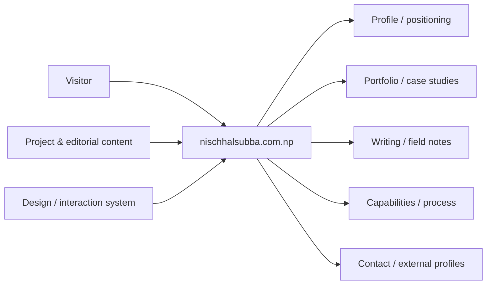
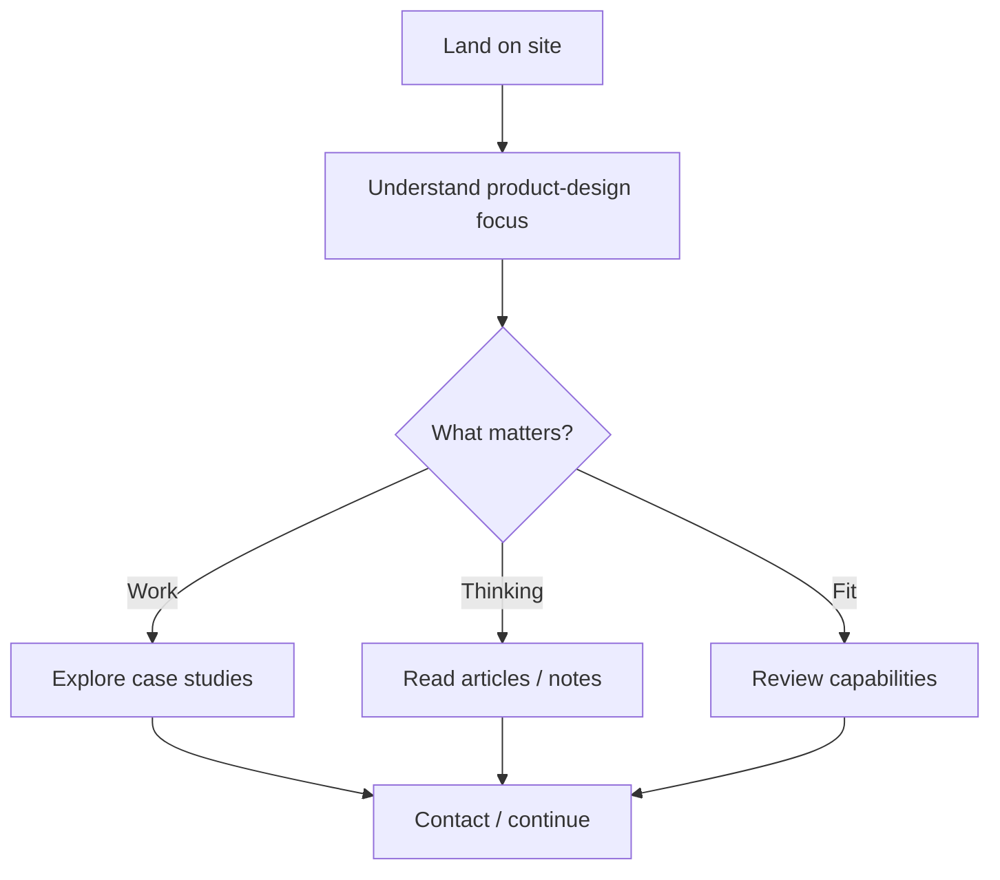
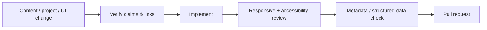

<div align="center">

# nischhalsubba.com.np

**The source repository for Nischhal Raj Subba's product-design portfolio and personal website, focused on clear case studies, systems thinking, writing, and professional contact.**


[Visit website](https://nischhalsubba.com.np/) · [Browse source](https://github.com/Nischhalsubba/nischhalsubba.com.np/tree/main) · [Issues](https://github.com/Nischhalsubba/nischhalsubba.com.np/issues)

</div>

## Overview

This repository powers a personal product-design presence: portfolio work, capability framing, writing, and contact paths. The site should help a visitor understand product thinking and project evidence before visual decoration asks for attention.

<details open>
<summary><strong>🏗️ Interactive portfolio architecture</strong></summary>



</details>

## Visitor flow



## Audience guide

| Audience | Focus |
|---|---|
| Clients / hiring teams | Product thinking, relevant work and evidence |
| Developers | Site structure, content system, assets and deployment |
| Designers | Case-study storytelling, visual system, interaction and accessibility |
| Content owner | Accurate claims, projects, articles, metadata and links |

## Getting started

```bash
git clone https://github.com/Nischhalsubba/nischhalsubba.com.np.git
cd nischhalsubba.com.np
```

Use the committed manifests and lockfiles to determine the supported runtime and development commands.

## Design & accessibility

Keep project storytelling clear, images purposeful, headings meaningful, focus visible, navigation predictable, motion respectful of reduced-motion preferences, and layouts readable across device sizes. Never let portfolio chrome overwhelm the work it is supposed to explain.

## SEO & discoverability

Maintain unique titles and descriptions for portfolio and article pages, semantic headings, internal links between related work and writing, canonical URLs, sitemap/robots configuration, Open Graph metadata, meaningful image alt text, and structured `Person`, `Article`, or `CreativeWork` data where appropriate. Use accurate terms around **product design, UX design, interaction design, design systems, SaaS, fintech, Web3, product strategy, and front-end collaboration** only where supported by actual work.

## Contribution flow


