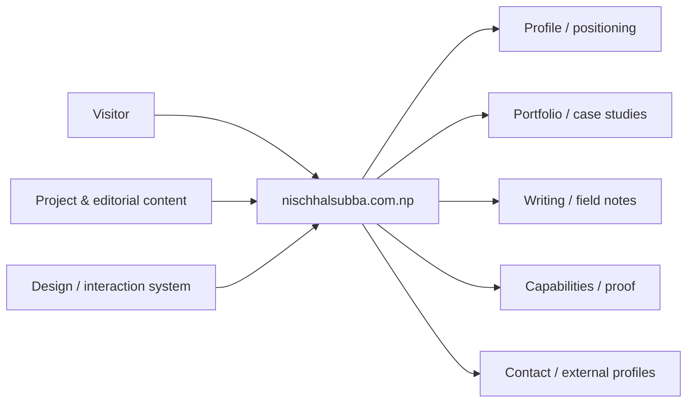
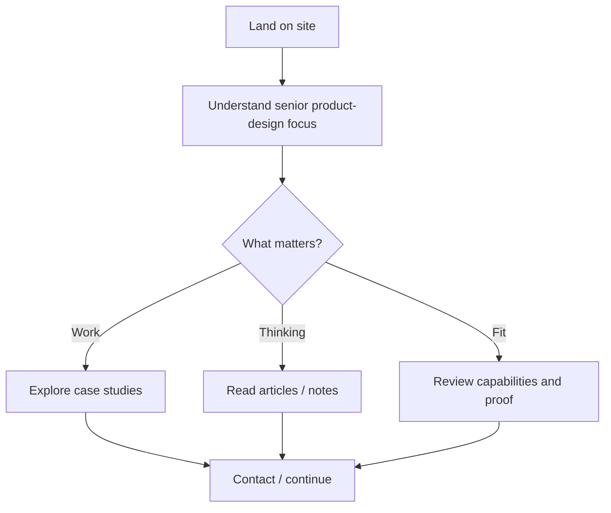
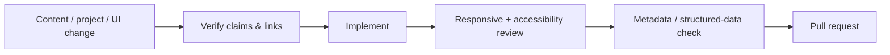

<div align="center">

# nischhalsubba.com.np

**The source repository for Nischhal Raj Subba, a Senior Product Designer focused on complex SaaS, fintech, design systems, and design-to-engineering delivery.**


[Visit website](https://nischhalsubba.com.np/) · [Selected work](https://nischhalsubba.com.np/projects) · [Uxcel](https://app.uxcel.com/ux/nischhal) · [LinkedIn](https://www.linkedin.com/in/nischhal/)

</div>

## Overview

This repository powers Nischhal Raj Subba's professional product-design presence: case studies, capability framing, writing, structured profile data, and contact paths. The market focus is intentionally narrow: **complex SaaS and fintech workflows, scalable design systems, and stronger continuity between product design and engineering**.

The site should help hiring teams and clients understand product reasoning, implementation awareness, and evidence before visual decoration asks for attention.

## Positioning

| Area | Focus |
|---|---|
| Complex SaaS | Multi-role workflows, dashboards, permissions, states, data-heavy interfaces |
| Fintech UX | Trust, verification, applications, transactions, status architecture |
| Design systems | Reusable components, patterns, tokens, responsive behavior, documentation |
| Design-to-engineering | Build-ready handoff, implementation context, UI QA, front-end collaboration |

Independent proof includes a public [Uxcel mentor profile](https://app.uxcel.com/ux/nischhal) and listing in Uxcel's [Hall of Fame / past UX ranking winners](https://uxcel.com/designer-rankings/past-winners).

<details open>
<summary><strong>Interactive portfolio architecture</strong></summary>



</details>

## Visitor flow



## Audience guide

| Audience | Focus |
|---|---|
| Clients / hiring teams | Product thinking, relevant work, specialization and evidence |
| Developers | Site structure, content system, assets and deployment |
| Designers | Case-study storytelling, design systems, interaction and accessibility |
| Content owner | Accurate claims, projects, articles, metadata and proof links |

## Getting started

```bash
git clone https://github.com/Nischhalsubba/nischhalsubba.com.np.git
cd nischhalsubba.com.np
```

Use the committed manifests and lockfiles to determine the supported runtime and development commands.

## Design & accessibility

Keep project storytelling clear, images purposeful, headings meaningful, focus visible, navigation predictable, motion respectful of reduced-motion preferences, and layouts readable across device sizes. Never let portfolio chrome overwhelm the work it is supposed to explain.

## SEO & discoverability

Maintain unique titles and descriptions for portfolio and article pages, semantic headings, internal links between related work and writing, canonical URLs, sitemap/robots configuration, Open Graph metadata, meaningful image alt text, and structured `Person`, `Article`, or `CreativeWork` data where appropriate. Use accurate terms around **Senior Product Designer, complex SaaS, fintech UX, design systems, product strategy, workflow architecture, and design-to-engineering delivery** only where supported by actual work.

## Contribution flow


