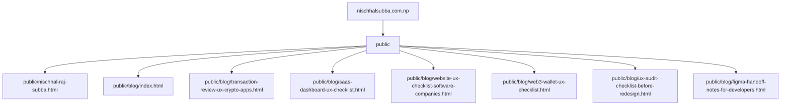
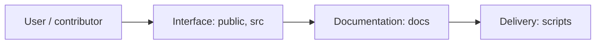
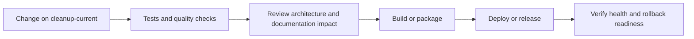
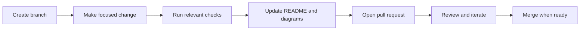

<!-- interactive-readme-standard:start -->

<div align="center">

# nischhalsubba.com.np

**Branch-aware technical guide for [`cleanup-current`](https://github.com/Nischhalsubba/nischhalsubba.com.np/tree/cleanup-current)**

<p>       </p>

<p>
  <a href="https://github.com/Nischhalsubba/nischhalsubba.com.np/tree/cleanup-current"><strong>Browse source</strong></a> ·
  <a href="https://github.com/Nischhalsubba/nischhalsubba.com.np/issues"><strong>Issues</strong></a> ·
  <a href="https://github.com/Nischhalsubba/nischhalsubba.com.np/codespaces/new?ref=cleanup-current"><strong>Open in Codespaces</strong></a>
</p>

</div>

> [!IMPORTANT]
> This guide is generated from the files actually present on `cleanup-current`. It links to detected source paths, preserves project-authored notes, and avoids claiming components that were not found.

## At a glance

| Item | Detected value |
|---|---|
| Purpose | A web or interface project documented from the files currently present on this branch. |
| Branch role | Compared with `main` |
| Stack | Vite, TypeScript, WordPress, HTML, JavaScript, PHP, CSS |
| Manifests | package.json |
| Prerequisites | Node.js |
| Delivery | No conventional deployment configuration detected |
| License | No license file detected |

## Branch scope

This branch differs from the default branch in the following detected paths:

- [`404.php`](https://github.com/Nischhalsubba/nischhalsubba.com.np/blob/cleanup-current/404.php)
- [`README.md`](https://github.com/Nischhalsubba/nischhalsubba.com.np/blob/cleanup-current/README.md)
- [`README.txt`](https://github.com/Nischhalsubba/nischhalsubba.com.np/blob/cleanup-current/README.txt)
- [`_redirects`](https://github.com/Nischhalsubba/nischhalsubba.com.np/blob/cleanup-current/_redirects)
- [`archive-project.php`](https://github.com/Nischhalsubba/nischhalsubba.com.np/blob/cleanup-current/archive-project.php)
- [`blog-design-systems-front-end.html`](https://github.com/Nischhalsubba/nischhalsubba.com.np/blob/cleanup-current/blog-design-systems-front-end.html)
- [`blog-gaming-interface-clarity.html`](https://github.com/Nischhalsubba/nischhalsubba.com.np/blob/cleanup-current/blog-gaming-interface-clarity.html)
- [`blog-good-handoff.html`](https://github.com/Nischhalsubba/nischhalsubba.com.np/blob/cleanup-current/blog-good-handoff.html)
- [`blog-portfolio-product.html`](https://github.com/Nischhalsubba/nischhalsubba.com.np/blob/cleanup-current/blog-portfolio-product.html)
- [`blog-service-websites.html`](https://github.com/Nischhalsubba/nischhalsubba.com.np/blob/cleanup-current/blog-service-websites.html)
- [`blog-web3-products.html`](https://github.com/Nischhalsubba/nischhalsubba.com.np/blob/cleanup-current/blog-web3-products.html)

## Quick start

```bash
npm install
npm run dev
npm run build
npm run preview
```

### Configuration surface

- No committed environment example file was detected.

> Never commit secrets, private keys, production credentials, customer data, or unredacted infrastructure details.

## Repository map

```mermaid
flowchart TD
    ROOT["nischhalsubba.com.np / cleanup-current"]
    ROOT --> P0["assets/"]
    ROOT --> P1["blog/"]
    ROOT --> P2["docs/"]
    ROOT --> P3["public/"]
    ROOT --> P4["scripts/"]
    ROOT --> P5["src/"]
    ROOT --> P6["wordpress/"]
    ROOT --> P7[".editorconfig"]
    ROOT --> P8[".gitignore"]
    ROOT --> P9["about.html"]
    ROOT --> P10["ai-profile.json"]
    ROOT --> P11["blog-accessibility-fintech.html"]
    ROOT --> P12["blog-ai-ops.html"]
    ROOT --> P13["blog-design-metrics.html"]
    ROOT --> P14["blog-enterprise-ux.html"]
    ROOT --> P15["blog-governance.html"]
    ROOT --> P16["blog-handoff.html"]
    ROOT --> P17["blog-pricing-ux.html"]
    ROOT --> MORE["+ 58 more top-level entries"]
```



| Responsibility | Detected source paths |
|---|---|
| Interface | [`public`](https://github.com/Nischhalsubba/nischhalsubba.com.np/tree/cleanup-current/public), [`src`](https://github.com/Nischhalsubba/nischhalsubba.com.np/tree/cleanup-current/src) |
| Documentation | [`docs`](https://github.com/Nischhalsubba/nischhalsubba.com.np/tree/cleanup-current/docs) |
| Delivery | [`scripts`](https://github.com/Nischhalsubba/nischhalsubba.com.np/tree/cleanup-current/scripts) |

## Website or application map



## Architecture and responsibility flow




## Quality, security, and operations

<table>
<tr>
<td width="33%" valign="top">

### Quality

- No conventional test directory was detected automatically.

Detected commands:
- `npm run dev`
- `npm run build`
- `npm run preview`

</td>
<td width="33%" valign="top">

### Security

- No dedicated security policy or automated dependency configuration was detected.

Review authentication, authorization, input validation, dependency updates, secret handling, and failure recovery before release.

</td>
<td width="34%" valign="top">

### Observability

- No dedicated observability integration was detected automatically.

Define useful logs, metrics, traces, alerts, and rollback signals for production-facing branches.

</td>
</tr>
</table>

## Delivery flow



### Automation detected

- No GitHub Actions workflow files were detected.

## Contribution flow



- Keep changes focused and explain architectural consequences.
- Run the checks relevant to the changed area.
- Update diagrams whenever routes, modules, data models, authentication, jobs, or delivery paths change.
- Add screenshots or recordings for visual behavior changes when useful.
- Use issues for reproducible defects and pull requests for reviewable changes.

## Ownership and support

| Topic | Source |
|---|---|
| Repository | [`Nischhalsubba/nischhalsubba.com.np`](https://github.com/Nischhalsubba/nischhalsubba.com.np) |
| Branch | [`cleanup-current`](https://github.com/Nischhalsubba/nischhalsubba.com.np/tree/cleanup-current) |
| Ownership | No CODEOWNERS file detected |
| Contributing | Use the contribution flow above |
| Support | [Open or review issues](https://github.com/Nischhalsubba/nischhalsubba.com.np/issues) |
| License | No license file detected |

<details>
<summary><strong>Documentation maintenance checklist</strong></summary>

- [ ] Purpose and branch scope are accurate.
- [ ] Setup and configuration commands still work.
- [ ] Repository, application, API, data, authentication, job, and deployment diagrams match the code.
- [ ] Tests, security controls, observability, and rollback behavior are documented.
- [ ] Links point to real files on this branch.
- [ ] No secrets or private operational details are exposed.

</details>

<!-- interactive-readme-standard:end -->

<!-- project-authored-notes:start -->
<details>
<summary><strong>Project-authored notes preserved from this branch</strong></summary>

# Nischhal Raj Subba Portfolio

Static, SEO-focused portfolio for **Nischhal Raj Subba**, a Product Designer in Nepal focused on Web3 UX, SaaS interfaces, fintech app experiences, service website UX, design systems, UX audits, and front-end-aware design.

[](#development)
[](#structure)
[](#seo-and-ai-discovery)

---

## Overview

This repository powers:

```txt
https://nischhalsubba.com.np/
```

The site is intentionally built as a static multi-page portfolio rather than a framework-heavy app. It includes:

- a canonical homepage at `/`
- project listing and project detail pages
- blog listing and blog detail pages
- service/SEO landing pages
- AI discovery files for agents and LLM crawlers
- sitemap, robots, manifest, and structured data
- Vite build configuration for Cloudflare Pages
- runtime JavaScript split into focused modules under `src/scripts/`

The repository root has many `.html` files because those files are public routes. Messy-looking? A little. Dangerous to move randomly? Absolutely.

---

## Structure

```txt
.
├── index.html                       # Canonical homepage
├── home.html                        # Legacy/home experiment retained in build
├── home-v2.html                     # Legacy/home experiment retained in build
├── about.html                       # About page
├── contact.html                     # Contact and lead page
├── projects.html                    # Project listing page
├── blog.html                        # Blog listing fallback page
├── blog/                            # Canonical blog route and blog detail source pages
├── project-*.html                   # Public project detail routes
├── *-designer.html                  # Service/SEO landing pages
├── ux-audit.html                    # Service/SEO landing page
├── assets/                          # Images, SVG covers, vendor files, project data
├── public/                          # Files Vite copies automatically
├── src/scripts/                     # Modular browser runtime
├── scripts/                         # Build, audit, link, and generation scripts
├── docs/                            # Maintainer documentation
├── script.js                        # Compatibility wrapper for old HTML references
├── style.css                        # Main legacy/global stylesheet
├── seo-ui-enhancements.css          # Shared polish layer loaded across pages
├── robots.txt                       # Root-served crawler instructions
├── sitemap.xml                      # Root-served sitemap
├── llms.txt                         # AI-agent summary
├── ai-profile.json                  # Machine-readable profile
├── site.webmanifest                 # Browser/search identity metadata
├── vite.config.ts                   # Multi-page Vite build config
├── wrangler.toml                    # Cloudflare Pages output config
└── package.json
```

More detailed maps:

- `docs/root-route-map.md`
- `docs/codebase-structure.md`
- `docs/build-pipeline.md`

---

## Why the root has many files

Most root HTML files are route files. For example:

```txt
project-yarsha.html -> /project-yarsha.html
about.html          -> /about.html
```

Moving those files breaks routes unless `vite.config.ts`, internal links, sitemap entries, redirects, and build audits are updated together. So yes, the root has clutter. No, the correct fix is not throwing files into `/pages` and hoping Cloudflare develops empathy.

---

## Development

Install dependencies:

```bash
npm install
```

Run locally:

```bash
npm run dev
```

Build:

```bash
npm run build
```

Preview production build:

```bash
npm run preview
```

Check local links:

```bash
npm run check:links
```

---

## Build pipeline

`npm run build` runs:

```txt
vite build
node scripts/copy-static-assets.cjs
node scripts/generate-resume-pdf.cjs
node scripts/audit-build.cjs
```

The custom build steps exist because Vite does not automatically place every required root-served runtime, SEO, AI discovery, or generated file exactly where Cloudflare needs it.

Important files copied into `dist/` after the Vite build include:

```txt
robots.txt
sitemap.xml
llms.txt
ai-profile.json
seo-ui-enhancements.css
site.webmanifest
script.js
src/scripts/
assets/
```

---

## Deployment

Recommended Cloudflare Pages settings:

```txt
Build command: npm run build
Output directory: dist
```

This is a Vite static site, not a Next.js app.

---

## SEO and AI discovery

The site includes:

- title tags and meta descriptions
- canonical URLs
- Open Graph/Twitter metadata
- JSON-LD structured data
- sitemap at `/sitemap.xml`
- robots file at `/robots.txt`
- LLM summary at `/llms.txt`
- machine-readable profile at `/ai-profile.json`
- web manifest at `/site.webmanifest`

Primary SEO topics:

- Product Designer in Nepal
- UI UX Designer Nepal
- Web3 UX Designer
- SaaS UX Designer
- Fintech Product Designer
- Website UX Designer
- UX Audit
- Figma Design Systems
- Front-end-aware Product Designer

---

## Runtime architecture

Browser behavior starts at:

```txt
script.js -> src/scripts/main.js
```

Feature modules live in:

```txt
src/scripts/features/
```

Shared DOM helpers live in:

```txt
src/scripts/utils/
```

Add new behavior as a focused feature module and import it from `src/scripts/main.js`. Avoid sprinkling inline scripts across HTML pages unless there is a very good reason and a small apology note.

---

## Content rules

Portfolio copy should stay truthful and specific.

- Do not invent metrics, awards, rankings, or outcomes.
- Mark team contributions clearly.
- Separate designed, developed, contributed, explored, and ongoing work.
- Keep NDA projects private or anonymized.
- Use real prototype links only where they belong.
- Keep each blog and project page focused on its subject.

---

## Maintenance checklist

Before deploying major changes:

- [ ] `npm run build` succeeds.
- [ ] `/` loads the current homepage.
- [ ] `/projects.html` loads.
- [ ] `/about.html` loads.
- [ ] `/contact.html` loads.
- [ ] `/blog/` loads.
- [ ] `/sitemap.xml` loads.
- [ ] `/robots.txt` loads.
- [ ] `/llms.txt` loads.
- [ ] `/ai-profile.json` loads.
- [ ] Project cards link to valid detail pages.
- [ ] Blog cards link to valid detail pages.
- [ ] The resume download points to `/assets/resume.pdf`.

---

## Ownership

Designed, written, and maintained by **Nischhal Raj Subba**.

GitHub: [@Nischhalsubba](https://github.com/Nischhalsubba)

</details>
<!-- project-authored-notes:end -->
