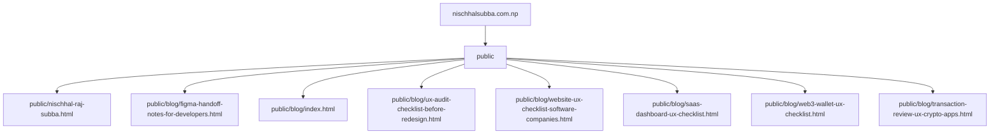
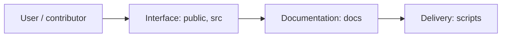
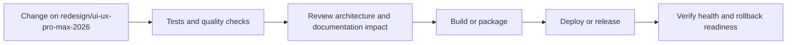
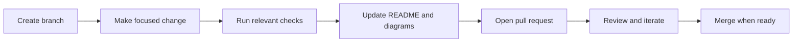

<!-- interactive-readme-standard:start -->

<div align="center">

# nischhalsubba.com.np

**Branch-aware technical guide for [`redesign/ui-ux-pro-max-2026`](https://github.com/Nischhalsubba/nischhalsubba.com.np/tree/redesign/ui-ux-pro-max-2026)**

<p>       </p>

<p>
  <a href="https://github.com/Nischhalsubba/nischhalsubba.com.np/tree/redesign/ui-ux-pro-max-2026"><strong>Browse source</strong></a> ·
  <a href="https://github.com/Nischhalsubba/nischhalsubba.com.np/issues"><strong>Issues</strong></a> ·
  <a href="https://github.com/Nischhalsubba/nischhalsubba.com.np/codespaces/new?ref=redesign%2Fui-ux-pro-max-2026"><strong>Open in Codespaces</strong></a>
</p>

</div>

> [!IMPORTANT]
> This guide is generated from the files actually present on `redesign/ui-ux-pro-max-2026`. It links to detected source paths, preserves project-authored notes, and avoids claiming components that were not found.

## At a glance

| Item | Detected value |
|---|---|
| Purpose | A web or interface project documented from the files currently present on this branch. |
| Branch role | Compared with `main` |
| Stack | Vite, TypeScript, WordPress, HTML, JavaScript, PHP, CSS |
| Manifests | package.json |
| Prerequisites | Node.js |
| Delivery | No conventional deployment configuration detected |
| License | No license file detected |

## Branch scope

This branch differs from the default branch in the following detected paths:

- [`README.md`](https://github.com/Nischhalsubba/nischhalsubba.com.np/blob/redesign/ui-ux-pro-max-2026/README.md)
- [`home-v2.html`](https://github.com/Nischhalsubba/nischhalsubba.com.np/blob/redesign/ui-ux-pro-max-2026/home-v2.html)
- [`index.html`](https://github.com/Nischhalsubba/nischhalsubba.com.np/blob/redesign/ui-ux-pro-max-2026/index.html)
- [`projects.html`](https://github.com/Nischhalsubba/nischhalsubba.com.np/blob/redesign/ui-ux-pro-max-2026/projects.html)
- [`redesign.css`](https://github.com/Nischhalsubba/nischhalsubba.com.np/blob/redesign/ui-ux-pro-max-2026/redesign.css)

## Quick start

```bash
npm install
npm run dev
npm run build
npm run preview
```

### Configuration surface

- No committed environment example file was detected.

> Never commit secrets, private keys, production credentials, customer data, or unredacted infrastructure details.

## Repository map

```mermaid
flowchart TD
    ROOT["nischhalsubba.com.np / redesign/ui-ux-pro-max-2026"]
    ROOT --> P0["assets/"]
    ROOT --> P1["blog/"]
    ROOT --> P2["docs/"]
    ROOT --> P3["public/"]
    ROOT --> P4["scripts/"]
    ROOT --> P5["src/"]
    ROOT --> P6["wordpress/"]
    ROOT --> P7[".editorconfig"]
    ROOT --> P8[".gitignore"]
    ROOT --> P9["404.php"]
    ROOT --> P10["_redirects"]
    ROOT --> P11["about.html"]
    ROOT --> P12["archive-project.php"]
    ROOT --> P13["blog-accessibility-fintech.html"]
    ROOT --> P14["blog-ai-ops.html"]
    ROOT --> P15["blog-design-metrics.html"]
    ROOT --> P16["blog-design-systems-front-end.html"]
    ROOT --> P17["blog-detail.html"]
    ROOT --> MORE["+ 68 more top-level entries"]
```



| Responsibility | Detected source paths |
|---|---|
| Interface | [`public`](https://github.com/Nischhalsubba/nischhalsubba.com.np/tree/redesign/ui-ux-pro-max-2026/public), [`src`](https://github.com/Nischhalsubba/nischhalsubba.com.np/tree/redesign/ui-ux-pro-max-2026/src) |
| Documentation | [`docs`](https://github.com/Nischhalsubba/nischhalsubba.com.np/tree/redesign/ui-ux-pro-max-2026/docs) |
| Delivery | [`scripts`](https://github.com/Nischhalsubba/nischhalsubba.com.np/tree/redesign/ui-ux-pro-max-2026/scripts) |

## Website or application map



## Architecture and responsibility flow




## Quality, security, and operations

<table>
<tr>
<td width="33%" valign="top">

### Quality

- No conventional test directory was detected automatically.

Detected commands:
- `npm run dev`
- `npm run build`
- `npm run preview`

</td>
<td width="33%" valign="top">

### Security

- No dedicated security policy or automated dependency configuration was detected.

Review authentication, authorization, input validation, dependency updates, secret handling, and failure recovery before release.

</td>
<td width="34%" valign="top">

### Observability

- No dedicated observability integration was detected automatically.

Define useful logs, metrics, traces, alerts, and rollback signals for production-facing branches.

</td>
</tr>
</table>

## Delivery flow



### Automation detected

- No GitHub Actions workflow files were detected.

## Contribution flow



- Keep changes focused and explain architectural consequences.
- Run the checks relevant to the changed area.
- Update diagrams whenever routes, modules, data models, authentication, jobs, or delivery paths change.
- Add screenshots or recordings for visual behavior changes when useful.
- Use issues for reproducible defects and pull requests for reviewable changes.

## Ownership and support

| Topic | Source |
|---|---|
| Repository | [`Nischhalsubba/nischhalsubba.com.np`](https://github.com/Nischhalsubba/nischhalsubba.com.np) |
| Branch | [`redesign/ui-ux-pro-max-2026`](https://github.com/Nischhalsubba/nischhalsubba.com.np/tree/redesign/ui-ux-pro-max-2026) |
| Ownership | No CODEOWNERS file detected |
| Contributing | Use the contribution flow above |
| Support | [Open or review issues](https://github.com/Nischhalsubba/nischhalsubba.com.np/issues) |
| License | No license file detected |

<details>
<summary><strong>Documentation maintenance checklist</strong></summary>

- [ ] Purpose and branch scope are accurate.
- [ ] Setup and configuration commands still work.
- [ ] Repository, application, API, data, authentication, job, and deployment diagrams match the code.
- [ ] Tests, security controls, observability, and rollback behavior are documented.
- [ ] Links point to real files on this branch.
- [ ] No secrets or private operational details are exposed.

</details>

<!-- interactive-readme-standard:end -->

<!-- project-authored-notes:start -->
<details>
<summary><strong>Project-authored notes preserved from this branch</strong></summary>

# Nischhal Raj Subba Portfolio

A static, SEO-focused portfolio for **Nischhal Raj Subba**, a Product Designer in Nepal focused on Web3 UX, SaaS interfaces, fintech app experience, service website UX, design systems, and front-end-aware design.

[](#development)
[](#structure)
[](#seo)

---

## Overview

This repository powers `nischhalsubba.com.np`.

The website is designed as a product-design portfolio, not only a personal homepage. It includes:

- a homepage with positioning, achievements, selected work, writing, and CTA
- a project listing page with search/filter behavior
- project detail pages for Web3, SaaS, fintech, website, mobile, and front-end work
- a folder-based blog route for SEO-friendly articles
- sitemap, robots, and Cloudflare Pages redirects
- Vite build configuration for multi-page static deployment

The current production route for the homepage is handled by Cloudflare Pages redirects:

```txt
/ -> /home-v2.html
```

The current production blog route is handled as a physical public route:

```txt
/blog/ -> public/blog/index.html
```

---

## Structure

```txt
.
├── home-v2.html                     # Current homepage used by _redirects
├── index.html                       # Legacy/original homepage kept for reference
├── about.html                       # About page
├── contact.html                     # Contact and lead page
├── projects.html                    # Project listing page
├── blog.html                        # Blog listing fallback page
├── blog/                            # Source blog detail pages included in Vite build
├── project-*.html                   # Project detail pages
├── public/                          # Files copied directly into Vite dist
│   ├── _redirects
│   ├── robots.txt
│   ├── sitemap.xml
│   ├── detail-navigation.js
│   ├── seo-enhancements.js
│   └── blog/index.html
├── src/
│   └── scripts/
│       ├── main.js                  # Browser runtime entrypoint
│       ├── features/                # Focused UI behavior modules
│       └── utils/                   # Shared runtime helpers
├── assets/
│   ├── images/
│   └── js/project-data.js
├── docs/codebase-structure.md       # Maintainer guide
├── script.js                        # Compatibility wrapper for old HTML references
├── style.css
├── vite.config.ts
├── wrangler.jsonc
└── package.json
```

The browser runtime is no longer kept in one large file. Existing HTML pages still load `script.js`, but that file now imports the modular runtime from `src/scripts/main.js`.

---

## Key Pages

### Main pages

- `/` -> routed to `/home-v2.html`
- `/projects.html`
- `/about.html`
- `/blog/`
- `/contact.html`

### Blog pages

- `/blog/blog-web3-products.html`
- `/blog/blog-good-handoff.html`
- `/blog/blog-portfolio-product.html`
- `/blog/blog-service-websites.html`
- `/blog/blog-gaming-interface-clarity.html`
- `/blog/blog-design-systems-front-end.html`

### Featured project pages

- `/project-yarsha.html`
- `/project-mokshya.html`
- `/project-hamro-idea.html`
- `/project-morajaa.html`
- `/project-pihub.html`
- `/project-masteriyo.html`
- `/project-zapp.html`
- `/project-orkest.html`
- `/project-splashnode.html`
- `/project-neverwinter-parser.html`

---

## Development

Install dependencies:

```bash
npm install
```

Run locally:

```bash
npm run dev
```

Build:

```bash
npm run build
```

Preview production build:

```bash
npm run preview
```

Check local links:

```bash
npm run check:links
```

---

## Deployment

Recommended Cloudflare Pages settings:

```txt
Build command: npm run build
Output directory: dist
```

This repository also includes a temporary compatibility shim because Cloudflare was previously configured to run `npx next build`. The shim redirects that command to `npm run build`, but the dashboard setting should still be changed to the Vite build command above.

Important deployment files live in `public/` because Vite copies that folder directly into the final `dist/` build.

```txt
public/_redirects
public/robots.txt
public/sitemap.xml
public/blog/index.html
```

---

## SEO

The site includes:

- page-specific title tags
- meta descriptions
- canonical URLs
- Open Graph metadata
- schema/structured data on key pages
- root-safe internal links
- descriptive image alt text
- sitemap at `/sitemap.xml`
- robots file at `/robots.txt`

Primary SEO topics:

- Product Designer in Nepal
- Web3 UX Designer
- SaaS UX Designer
- Fintech Product Designer
- Website UX Designer
- Front-end-aware Product Designer
- Product Design Portfolio

---

## Content Rules

Portfolio copy should stay truthful and specific.

- Do not invent metrics, awards, or rankings.
- Mark team contributions clearly.
- Separate designed, developed, contributed, explored, and ongoing work.
- Keep NDA projects private or anonymized.
- Use real prototype links only where they belong.
- Keep each blog and project page focused on its subject.

---

## Maintenance Checklist

Before deploying major changes:

- [ ] `npm run build` succeeds.
- [ ] `/` loads the current homepage.
- [ ] `/blog` redirects to `/blog/` or loads the physical blog route.
- [ ] `/blog/` loads correctly.
- [ ] `/sitemap.xml` loads.
- [ ] `/robots.txt` loads.
- [ ] Project cards link to valid detail pages.
- [ ] Blog cards link to valid detail pages.
- [ ] No old links remain: `project-detail.html`, `project-jeweltrek.html`, `blog-detail.html`, `blog-web3-ux.html`.

---

## Ownership

Designed, written, and maintained by **Nischhal Raj Subba**.

GitHub: [@Nischhalsubba](https://github.com/Nischhalsubba)

</details>
<!-- project-authored-notes:end -->
