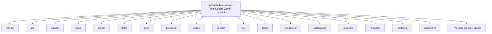
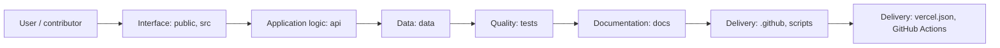
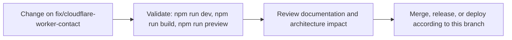

# Nischhal Raj Subba Portfolio

<!-- interactive-readme-standard:start -->

> [!NOTE]
> **Branch-specific documentation:** this section is maintained for [`fix/cloudflare-worker-contact`](https://github.com/Nischhalsubba/nischhalsubba.com.np/tree/fix/cloudflare-worker-contact). It is generated from the files present on this branch and preserves the project-authored README below.

<details open>
<summary><strong>Interactive repository guide</strong></summary>

## Branch overview

| Item | Value |
|---|---|
| Repository | [`Nischhalsubba/nischhalsubba.com.np`](https://github.com/Nischhalsubba/nischhalsubba.com.np) |
| Branch | [`fix/cloudflare-worker-contact`](https://github.com/Nischhalsubba/nischhalsubba.com.np/tree/fix/cloudflare-worker-contact) |
| Detected stack | Vite, TypeScript, WordPress, JavaScript, HTML, PHP, CSS |
| Detected manifests | package.json |
| Documentation policy | Every maintained branch must explain purpose, setup, structure, architecture, flows, testing, delivery, security, and ownership. |

## Repository structure



The diagram is generated from the branch's actual top-level files and directories. Use the branch link above for complete source navigation.

## Website or application structure

```mermaid
flowchart TD
    APP["nischhalsubba.com.np"]
    APP --> R0["src/app"]
    APP --> R1["public"]
    R0 --> F0["src/app/layout.tsx"]
    R1 --> F1["public/blog/design-handoff-checklist-startup-product-teams.html"]
    R1 --> F2["public/blog/design-systems-small-product-teams.html"]
    R1 --> F3["public/blog/figma-handoff-notes-for-developers.html"]
    R1 --> F4["public/blog/hire-product-designer-nepal-saas-web3.html"]
    R1 --> F5["public/blog/index.html"]
    R1 --> F6["public/blog/prioritize-ux-audit-findings-before-redesign.html"]
    R1 --> F7["public/blog/responsive-saas-dashboard-handoff-notes.html"]
    R1 --> F8["public/blog/role-based-saas-dashboard-ux.html"]
    R1 --> F9["public/blog/saas-dashboard-empty-state-ux-guide.html"]
    R1 --> F10["public/blog/saas-dashboard-empty-states-product-clarity.html"]
    R1 --> F11["public/blog/saas-dashboard-empty-states-that-help-users-recover.html"]
```



## Application and responsibility flow



## Change-to-delivery flow



## README requirements for this branch

- Explain what this branch contains and how it differs from the default branch.
- Keep installation, configuration, usage, testing, deployment, security, support, and license information accurate.
- Document repository, website or application, API, data, authentication, background-job, and deployment flows when they exist.
- Prefer Mermaid diagrams and expandable `<details>` sections for visual navigation.
- Link diagrams and modules to real source paths; never invent missing components.
- Preserve project-specific documentation and update diagrams whenever architecture or major paths change.
- Treat secrets, private infrastructure, customer data, and credentials as prohibited README content.

</details>

<!-- interactive-readme-standard:end -->

Static, SEO-focused portfolio for **Nischhal Raj Subba**, a Product Designer in Nepal focused on Web3 UX, SaaS interfaces, fintech app experiences, service website UX, design systems, UX audits, and front-end-aware design.

[](#development)
[](#structure)
[](#seo-and-ai-discovery)

---

## Overview

This repository powers:

```txt
https://nischhalsubba.com.np/
```

The site is intentionally built as a static multi-page portfolio rather than a framework-heavy app. It includes:

- a canonical homepage at `/`
- project listing and project detail pages
- blog listing and blog detail pages
- service/SEO landing pages
- AI discovery files for agents and LLM crawlers
- sitemap, robots, manifest, and structured data
- Vite build configuration for Cloudflare Pages
- runtime JavaScript split into focused modules under `src/scripts/`

The repository root has many `.html` files because those files are public routes. Messy-looking? A little. Dangerous to move randomly? Absolutely.

---

## Deployment note

Cloudflare Pages deploys the latest `main` branch build. Documentation-only commits may be used to trigger a fresh Pages rebuild when the previous deployment failed after a build-script or audit change.

---

## Structure

```txt
.
├── index.html                       # Canonical homepage
├── home.html                        # Legacy/home experiment retained in build
├── home-v2.html                     # Legacy/home experiment retained in build
├── about.html                       # About page
├── contact.html                     # Contact and lead page
├── projects.html                    # Project listing page
├── blog.html                        # Blog listing fallback page
├── blog/                            # Canonical blog route and blog detail source pages
├── project-*.html                   # Public project detail routes
├── *-designer.html                  # Service/SEO landing pages
├── ux-audit.html                    # Service/SEO landing page
├── assets/                          # Images, SVG covers, vendor files, project data
├── public/                          # Files Vite copies automatically
├── src/scripts/                     # Modular browser runtime
├── scripts/                         # Build, audit, link, and generation scripts
├── docs/                            # Maintainer documentation
├── script.js                        # Compatibility wrapper for old HTML references
├── style.css                        # Main legacy/global stylesheet
├── seo-ui-enhancements.css          # Shared polish layer loaded across pages
├── robots.txt                       # Root-served crawler instructions
├── sitemap.xml                      # Root-served sitemap
├── llms.txt                         # AI-agent summary
├── ai-profile.json                  # Machine-readable profile
├── site.webmanifest                 # Browser/search identity metadata
├── vite.config.ts                   # Multi-page Vite build config
├── wrangler.toml                    # Cloudflare Pages output config
└── package.json
```

More detailed maps:

- `docs/root-route-map.md`
- `docs/codebase-structure.md`
- `docs/build-pipeline.md`

---

## Why the root has many files

Most root HTML files are route files. For example:

```txt
project-yarsha.html -> /project-yarsha.html
about.html          -> /about.html
```

Moving those files breaks routes unless `vite.config.ts`, internal links, sitemap entries, redirects, and build audits are updated together. So yes, the root has clutter. No, the correct fix is not throwing files into `/pages` and hoping Cloudflare develops empathy.

---

## Development

Install dependencies:

```bash
npm install
```

Run locally:

```bash
npm run dev
```

Build:

```bash
npm run build
```

Preview production build:

```bash
npm run preview
```

Check local links:

```bash
npm run check:links
```

---
