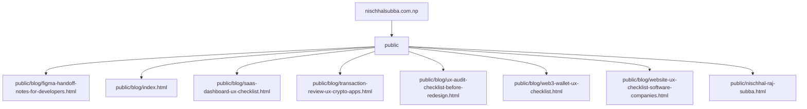
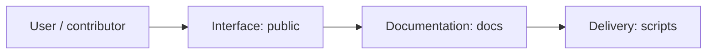
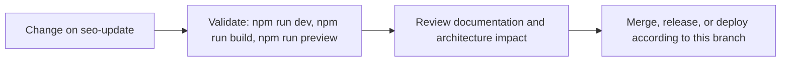

# Nischhal Raj Subba Portfolio

<!-- interactive-readme-standard:start -->

> [!NOTE]
> **Branch-specific documentation:** this section is maintained for [`seo-update`](https://github.com/Nischhalsubba/nischhalsubba.com.np/tree/seo-update). It is generated from the files present on this branch and preserves the project-authored README below.

<details open>
<summary><strong>Interactive repository guide</strong></summary>

## Branch overview

| Item | Value |
|---|---|
| Repository | [`Nischhalsubba/nischhalsubba.com.np`](https://github.com/Nischhalsubba/nischhalsubba.com.np) |
| Branch | [`seo-update`](https://github.com/Nischhalsubba/nischhalsubba.com.np/tree/seo-update) |
| Detected stack | Vite, TypeScript, WordPress, HTML, PHP, JavaScript, CSS |
| Detected manifests | package.json |
| Documentation policy | Every maintained branch must explain purpose, setup, structure, architecture, flows, testing, delivery, security, and ownership. |

## Repository structure

```mermaid
flowchart TD
    ROOT["nischhalsubba.com.np / seo-update"]
    ROOT --> P0["assets/"]
    ROOT --> P1["blog/"]
    ROOT --> P2["docs/"]
    ROOT --> P3["public/"]
    ROOT --> P4["scripts/"]
    ROOT --> P5["wordpress/"]
    ROOT --> P6[".editorconfig"]
    ROOT --> P7[".gitignore"]
    ROOT --> P8["404.php"]
    ROOT --> P9["_redirects"]
    ROOT --> P10["about.html"]
    ROOT --> P11["archive-project.php"]
    ROOT --> P12["blog-accessibility-fintech.html"]
    ROOT --> P13["blog-ai-ops.html"]
    ROOT --> P14["blog-design-metrics.html"]
    ROOT --> P15["blog-design-systems-front-end.html"]
    ROOT --> P16["blog-detail.html"]
    ROOT --> P17["blog-enterprise-ux.html"]
    ROOT --> MORE["+ 65 more top-level entries"]
```



The diagram is generated from the branch's actual top-level files and directories. Use the branch link above for complete source navigation.

## Website or application structure



## Application and responsibility flow



## Change-to-delivery flow



## README requirements for this branch

- Explain what this branch contains and how it differs from the default branch.
- Keep installation, configuration, usage, testing, deployment, security, support, and license information accurate.
- Document repository, website or application, API, data, authentication, background-job, and deployment flows when they exist.
- Prefer Mermaid diagrams and expandable `<details>` sections for visual navigation.
- Link diagrams and modules to real source paths; never invent missing components.
- Preserve project-specific documentation and update diagrams whenever architecture or major paths change.
- Treat secrets, private infrastructure, customer data, and credentials as prohibited README content.

</details>

<!-- interactive-readme-standard:end -->

A static, SEO-focused portfolio for **Nischhal Raj Subba**, a Product Designer in Nepal focused on Web3 UX, SaaS interfaces, fintech app experience, service website UX, design systems, and front-end-aware design.

[](#development)
[](#structure)
[](#seo)

---

## Overview

This repository powers `nischhalsubba.com.np`.

The website is designed as a product-design portfolio, not only a personal homepage. It includes:

- a homepage with positioning, achievements, selected work, writing, and CTA
- a project listing page with search/filter behavior
- project detail pages for Web3, SaaS, fintech, website, mobile, and front-end work
- a folder-based blog route for SEO-friendly articles
- sitemap, robots, and Cloudflare Pages redirects
- Vite build configuration for multi-page static deployment

The current production route for the homepage is handled by Cloudflare Pages redirects:

```txt
/ → /home-v2.html
```

The current production blog route is handled as a physical public route:

```txt
/blog/ → public/blog/index.html
```

---

## Structure

```txt
.
├── home-v2.html                     # Current homepage used by _redirects
├── index.html                       # Legacy/original homepage kept for reference
├── about.html                       # About page
├── contact.html                     # Contact and lead page
├── projects.html                    # Project listing page
├── blog.html                        # Blog listing fallback page
├── blog/                            # Source blog detail pages included in Vite build
│   ├── index.html
│   ├── blog-web3-products.html
│   ├── blog-good-handoff.html
│   ├── blog-portfolio-product.html
│   ├── blog-service-websites.html
│   ├── blog-gaming-interface-clarity.html
│   └── blog-design-systems-front-end.html
├── project-*.html                   # Project detail pages
├── public/                          # Files copied directly into Vite dist
│   ├── _redirects
│   ├── robots.txt
│   ├── sitemap.xml
│   └── blog/index.html              # Physical /blog/ route for Cloudflare Pages
├── assets/
│   ├── images/
│   └── js/project-data.js
├── script.js
├── style.css
├── vite.config.ts
└── package.json
```

---

## Key Pages

### Main pages

- `/` → routed to `/home-v2.html`
- `/projects.html`
- `/about.html`
- `/blog/`
- `/contact.html`

### Blog pages

- `/blog/blog-web3-products.html`
- `/blog/blog-good-handoff.html`
- `/blog/blog-portfolio-product.html`
- `/blog/blog-service-websites.html`
- `/blog/blog-gaming-interface-clarity.html`
- `/blog/blog-design-systems-front-end.html`

### Featured project pages

- `/project-yarsha.html`
- `/project-mokshya.html`
- `/project-hamro-idea.html`
- `/project-morajaa.html`
- `/project-pihub.html`
- `/project-masteriyo.html`
- `/project-zapp.html`
- `/project-orkest.html`
- `/project-splashnode.html`
- `/project-neverwinter-parser.html`

---

## Development

Install dependencies:

```bash
npm install
```

Run locally:

```bash
npm run dev
```

Build:

```bash
npm run build
```

Preview production build:

```bash
npm run preview
```

---

## Deployment

Recommended Cloudflare Pages settings:

```txt
Build command: npm run build
Output directory: dist
```

Important deployment files live in `public/` because Vite copies that folder directly into the final `dist/` build.

```txt
public/_redirects
public/robots.txt
public/sitemap.xml
public/blog/index.html
```

---

## SEO

The site includes:

- page-specific title tags
- meta descriptions
- canonical URLs
- Open Graph metadata
- schema/structured data on key pages
- root-safe internal links
- descriptive image alt text
- sitemap at `/sitemap.xml`
- robots file at `/robots.txt`

Primary SEO topics:

- Product Designer in Nepal
- Web3 UX Designer
- SaaS UX Designer
- Fintech Product Designer
- Website UX Designer
- Front-end-aware Product Designer
- Product Design Portfolio

---

## Content Rules

Portfolio copy should stay truthful and specific.

- Do not invent metrics, awards, or rankings.
- Mark team contributions clearly.
- Separate designed, developed, contributed, explored, and ongoing work.
- Keep NDA projects private or anonymized.
- Use real prototype links only where they belong.
- Keep each blog and project page focused on its subject.

---

## Maintenance Checklist

Before deploying major changes:

- [ ] `npm run build` succeeds.
- [ ] `/` loads the current homepage.
- [ ] `/blog` redirects to `/blog/` or loads the physical blog route.
- [ ] `/blog/` loads correctly.
- [ ] `/sitemap.xml` loads.
- [ ] `/robots.txt` loads.
- [ ] Project cards link to valid detail pages.
- [ ] Blog cards link to valid detail pages.
- [ ] No old links remain: `project-detail.html`, `project-jeweltrek.html`, `blog-detail.html`, `blog-web3-ux.html`.

---

## Ownership

Designed, written, and maintained by **Nischhal Raj Subba**.

GitHub: [@Nischhalsubba](https://github.com/Nischhalsubba)
