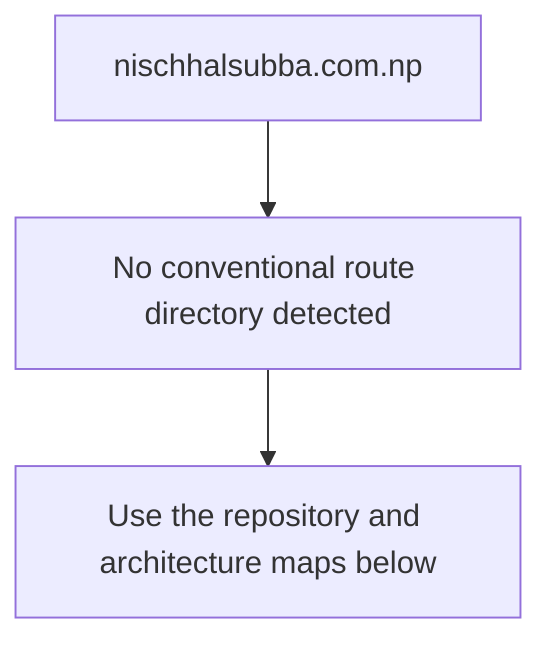
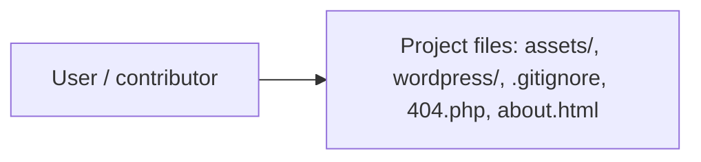
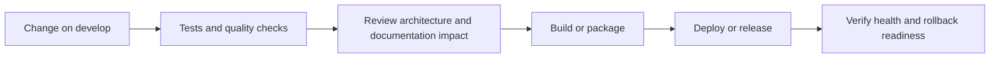
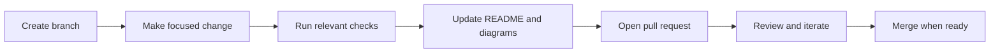

<!-- interactive-readme-standard:start -->

<div align="center">

# nischhalsubba.com.np

**Branch-aware technical guide for [`develop`](https://github.com/Nischhalsubba/nischhalsubba.com.np/tree/develop)**

<p>       </p>

<p>
  <a href="https://github.com/Nischhalsubba/nischhalsubba.com.np/tree/develop"><strong>Browse source</strong></a> ·
  <a href="https://github.com/Nischhalsubba/nischhalsubba.com.np/issues"><strong>Issues</strong></a> ·
  <a href="https://github.com/Nischhalsubba/nischhalsubba.com.np/codespaces/new?ref=develop"><strong>Open in Codespaces</strong></a>
</p>

</div>

> [!IMPORTANT]
> This guide is generated from the files actually present on `develop`. It links to detected source paths, preserves project-authored notes, and avoids claiming components that were not found.

## At a glance

| Item | Detected value |
|---|---|
| Purpose | A Vite project documented from the current branch structure and manifests. |
| Branch role | Compared with `main` |
| Stack | Vite, TypeScript, WordPress, PHP, HTML, CSS, JavaScript |
| Manifests | package.json |
| Prerequisites | Node.js |
| Delivery | No conventional deployment configuration detected |
| License | No license file detected |

## Branch scope

This branch differs from the default branch in the following detected paths:

- [`README.md`](https://github.com/Nischhalsubba/nischhalsubba.com.np/blob/develop/README.md)

## Quick start

```bash
npm install
npm run dev
npm run build
npm run preview
```

### Configuration surface

- No committed environment example file was detected.

> Never commit secrets, private keys, production credentials, customer data, or unredacted infrastructure details.

## Repository map

```mermaid
flowchart TD
    ROOT["nischhalsubba.com.np / develop"]
    ROOT --> P0["assets/"]
    ROOT --> P1["wordpress/"]
    ROOT --> P2[".gitignore"]
    ROOT --> P3["404.php"]
    ROOT --> P4["about.html"]
    ROOT --> P5["archive-project.php"]
    ROOT --> P6["blog-detail.html"]
    ROOT --> P7["blog.html"]
    ROOT --> P8["contact.html"]
    ROOT --> P9["footer.php"]
    ROOT --> P10["front-page.php"]
    ROOT --> P11["functions.php"]
    ROOT --> P12["header.php"]
    ROOT --> P13["home.php"]
    ROOT --> P14["index.html"]
    ROOT --> P15["index.php"]
    ROOT --> P16["index.tsx"]
    ROOT --> P17["metadata.json"]
    ROOT --> MORE["+ 17 more top-level entries"]
```



| Responsibility | Detected source paths |
|---|---|
| Project files | [`assets/`](https://github.com/Nischhalsubba/nischhalsubba.com.np/tree/develop/assets/), [`wordpress/`](https://github.com/Nischhalsubba/nischhalsubba.com.np/tree/develop/wordpress/), [`.gitignore`](https://github.com/Nischhalsubba/nischhalsubba.com.np/blob/develop/.gitignore), [`404.php`](https://github.com/Nischhalsubba/nischhalsubba.com.np/blob/develop/404.php), [`about.html`](https://github.com/Nischhalsubba/nischhalsubba.com.np/blob/develop/about.html) |

## Website or application map



## Architecture and responsibility flow




## Quality, security, and operations

<table>
<tr>
<td width="33%" valign="top">

### Quality

- No conventional test directory was detected automatically.

Detected commands:
- `npm run dev`
- `npm run build`
- `npm run preview`

</td>
<td width="33%" valign="top">

### Security

- No dedicated security policy or automated dependency configuration was detected.

Review authentication, authorization, input validation, dependency updates, secret handling, and failure recovery before release.

</td>
<td width="34%" valign="top">

### Observability

- No dedicated observability integration was detected automatically.

Define useful logs, metrics, traces, alerts, and rollback signals for production-facing branches.

</td>
</tr>
</table>

## Delivery flow



### Automation detected

- No GitHub Actions workflow files were detected.

## Contribution flow



- Keep changes focused and explain architectural consequences.
- Run the checks relevant to the changed area.
- Update diagrams whenever routes, modules, data models, authentication, jobs, or delivery paths change.
- Add screenshots or recordings for visual behavior changes when useful.
- Use issues for reproducible defects and pull requests for reviewable changes.

## Ownership and support

| Topic | Source |
|---|---|
| Repository | [`Nischhalsubba/nischhalsubba.com.np`](https://github.com/Nischhalsubba/nischhalsubba.com.np) |
| Branch | [`develop`](https://github.com/Nischhalsubba/nischhalsubba.com.np/tree/develop) |
| Ownership | No CODEOWNERS file detected |
| Contributing | Use the contribution flow above |
| Support | [Open or review issues](https://github.com/Nischhalsubba/nischhalsubba.com.np/issues) |
| License | No license file detected |

<details>
<summary><strong>Documentation maintenance checklist</strong></summary>

- [ ] Purpose and branch scope are accurate.
- [ ] Setup and configuration commands still work.
- [ ] Repository, application, API, data, authentication, job, and deployment diagrams match the code.
- [ ] Tests, security controls, observability, and rollback behavior are documented.
- [ ] Links point to real files on this branch.
- [ ] No secrets or private operational details are exposed.

</details>

<!-- interactive-readme-standard:end -->

<!-- project-authored-notes:start -->
<details>
<summary><strong>Project-authored notes preserved from this branch</strong></summary>

# Nischhal Raj Subba Portfolio Website

Designed and developed by **Nischhal Raj Subba**.

This repository contains the full source of my personal portfolio platform: a premium, dark-first, animation-rich website built to showcase product design work, writing, background, and contact channels.  
The codebase supports **two modes**:

1. **Static multi-page portfolio** (direct HTML/CSS/JS)
2. **WordPress theme version** (`wordpress/`) for CMS-driven publishing

---

## 1) Project Vision

This site is intentionally crafted as both a personal brand experience and a design-system-driven product:

- Communicate credibility in enterprise UX, design systems, and Web3 product design
- Keep visual quality high without sacrificing performance
- Preserve editorial clarity for case studies and long-form writing
- Ensure consistent behavior across desktop and mobile
- Maintain a scalable structure that can run as static pages or as a WordPress theme

---

## 2) Design Direction

### Core Principles

- **Clarity over decoration**: strong hierarchy, clean spacing, readable typography
- **Premium motion**: animation is used for storytelling, not just effects
- **System-first styling**: reusable tokens and component-level consistency
- **Dark-first with light-mode parity**: both themes are designed, not inverted
- **Human interaction details**: micro-interactions, cursor states, hover behaviors, smooth transitions

### Visual Language

- Serif + sans pairing for editorial and product-like contrast
- High-contrast headlines with outline-to-fill reveal treatment
- Frosted/glass navigation pill and floating utility controls
- Grid/spotlight background layer for depth
- Refined card system for projects, writing, testimonials, and content modules

### Typography

- Headings: `Playfair Display`
- Body/UI text: `Inter`
- Loaded from Google Fonts in the static version and dynamically via Customizer in WordPress

---

## 3) Experience Architecture (Pages)

The static site includes the following pages:

- `index.html` - home, hero, achievements, selected work, testimonials, insights, CTA
- `projects.html` - full project listing with filters and search
- `project-detail.html` - case study layout with role, process, and outcomes
- `about.html` - background, experience timeline, education, awards, skills
- `blog.html` - writing index
- `blog-detail.html` - article detail
- `products.html` - digital products section
- `contact.html` - contact details + message form UI

WordPress template equivalents are available under `wordpress/` (e.g., `front-page.php`, `page-about.php`, `archive-project.php`, `single-project.php`).

---

## 4) Technical Stack

### Core

- **HTML5**
- **CSS3** (custom properties, responsive layouts, utility patterns)
- **JavaScript (ES2022)** for interactions and UI state

### Motion & Interaction

- **GSAP** (`gsap.min.js`)
- **GSAP ScrollTrigger** for scroll-linked reveals and sequence timing

### Build/Tooling

- **Node.js**
- **Vite** (dev server, build, preview)
- **TypeScript config** present for modern bundler/compiler setup

### CMS Layer

- **WordPress custom theme** implementation in `wordpress/`
- Dynamic menus, custom post types, custom fields, Customizer controls, schema output

---

## 5) Repository Structure

```text
.
|-- about.html
|-- blog.html
|-- blog-detail.html
|-- contact.html
|-- index.html
|-- projects.html
|-- project-detail.html
|-- products.html
|-- style.css
|-- script.js
|-- assets/
|   |-- resume.pdf
|   |-- images/
|   |-- scripts/
|   `-- styles/
|-- wordpress/
|   |-- functions.php
|   |-- front-page.php
|   |-- header.php
|   |-- footer.php
|   |-- style.css
|   `-- js/main.js
|-- package.json
|-- vite.config.ts
`-- tsconfig.json
```

---

## 6) Key Frontend Features

- Theme toggle (dark/light) with persistent preference (`localStorage`)
- Dynamic image swapping per theme for portrait assets
- Animated mobile navigation overlay
- Active navigation glider behavior
- Scroll-triggered reveal animations
- Title outline-to-fill transition
- Interactive custom cursor (desktop/fine pointer only)
- Grid spotlight canvas background effect
- Category filtering for projects
- Search UI in work listing
- Floating resume download CTA

Performance safeguards:

- Reduced effects on touch devices
- `prefers-reduced-motion` support
- Conditional activation of heavier interactions

---

## 7) WordPress Theme Capabilities

The `wordpress/` folder extends the same design language into a CMS-managed theme with:

- Theme supports: thumbnails, custom logo, HTML5 features, responsive embeds, editor styles
- Registered menus: primary + footer
- Custom post types:
  - `project`
  - `product`
  - `testimonial`
- Custom taxonomy:
  - `project_category`
- Custom meta fields for project, product, writing, and testimonial content
- Extensive **Customizer** controls for:
  - Typography
  - Dark/light color tokens
  - Hero text/buttons/ticker
  - Interaction settings (cursor, animation speed, performance mode)
  - Footer content and social links
- JSON-LD schema output (Person / BlogPosting context)

---

## 8) Design System Notes

Main design tokens live in CSS variables (`:root` and `[data-theme="light"]`) and cover:

- Color palette (backgrounds, text tiers, borders, accents)
- Typography families
- Layer/z-index strategy
- Motion easings
- Spacing, container sizes, and responsive clamps

This creates consistent visual behavior across static and WordPress implementations.

---

## 9) Personal Branding & Content Focus

The portfolio emphasizes:

- Product Design
- Design Systems
- Enterprise UX
- Web3 interfaces
- Fintech problem spaces

Public-facing channels integrated in the website:

- LinkedIn
- Behance
- Uxcel
- Dribbble
- Figma
- X (Twitter)
- Email contact

---

## 10) Local Development

### Prerequisites

- Node.js (LTS recommended)
- npm

### Run in development

```bash
npm install
npm run dev
```

### Build and preview

```bash
npm run build
npm run preview
```

### Available scripts

- `npm run dev` - start Vite dev server
- `npm run build` - production build
- `npm run preview` - preview production build locally

---

## 11) WordPress Installation (Theme Mode)

1. Copy the `wordpress/` directory into `wp-content/themes/`
2. Rename folder if needed (example: `nischhal-portfolio`)
3. Ensure `assets/` resources are present and correctly referenced
4. Activate theme in **Appearance > Themes**
5. Configure content through:
   - Projects / Products / Testimonials post types
   - Posts (writing/blog)
   - Customizer sections for design and homepage controls
   - Menus for navigation

Reference: `wordpress/README.txt`

---

## 12) Content Editing Guide (Static Mode)

- Homepage hero and featured areas: `index.html`
- About timeline and profile narrative: `about.html`
- Work cards/filters: `projects.html`
- Case-study detail content: `project-detail.html`
- Writing archive and article detail: `blog.html`, `blog-detail.html`
- Contact info and form UI: `contact.html`
- Global styling: `style.css`
- Interaction/motion logic: `script.js`

---

## 13) Asset Notes

- Resume file: `assets/resume.pdf`
- Local image assets are in `assets/images/`
- Some demo visuals are remote-hosted image URLs (Unsplash / Imgur) in HTML content

If you move to full self-hosting/CDN, replace external URLs with local or managed asset paths.

---

## 14) SEO & Metadata

Static version includes page-level titles/descriptions.  
WordPress version adds structured data output via `nischhal_seo_schema()` and customizable content through theme options.

---

## 15) Accessibility & UX Considerations

- Semantic HTML structure and descriptive links
- Theme toggle for user preference
- Motion reduction path for accessibility/performance
- Mobile-specific interaction handling
- Clear text hierarchy and contrast-forward palette

---

## 16) Deployment Options

This project can be deployed as:

1. **Static website** (Netlify, Vercel, GitHub Pages, traditional hosting)
2. **WordPress theme** on managed or self-hosted WordPress infrastructure

---

## 17) Roadmap (Practical Next Enhancements)

- Form backend integration for `contact.html`
- Image optimization pipeline (WebP/AVIF + responsive `srcset`)
- Optional analytics/events instrumentation
- Internationalization-ready content structure
- Automated accessibility and performance audits in CI

---

## 18) Ownership

This website and its portfolio system are designed and developed by **Nischhal Raj Subba**.

</details>
<!-- project-authored-notes:end -->
