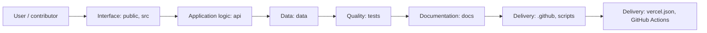
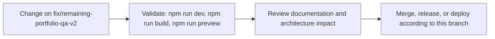

# Nischhal Raj Subba Portfolio

<!-- interactive-readme-standard:start -->

> [!NOTE]
> **Branch-specific documentation:** this section is maintained for [`fix/remaining-portfolio-qa-v2`](https://github.com/Nischhalsubba/nischhalsubba.com.np/tree/fix/remaining-portfolio-qa-v2). It is generated from the files present on this branch and preserves the project-authored README below.

<details open>
<summary><strong>Interactive repository guide</strong></summary>

## Branch overview

| Item | Value |
|---|---|
| Repository | [`Nischhalsubba/nischhalsubba.com.np`](https://github.com/Nischhalsubba/nischhalsubba.com.np) |
| Branch | [`fix/remaining-portfolio-qa-v2`](https://github.com/Nischhalsubba/nischhalsubba.com.np/tree/fix/remaining-portfolio-qa-v2) |
| Detected stack | Vite, TypeScript, WordPress, JavaScript, HTML, PHP, CSS |
| Detected manifests | package.json |
| Documentation policy | Every maintained branch must explain purpose, setup, structure, architecture, flows, testing, delivery, security, and ownership. |

## Repository structure

```mermaid
flowchart TD
    ROOT["nischhalsubba.com.np / fix/remaining-portfolio-qa-v2"]
    ROOT --> P0[".github/"]
    ROOT --> P1["api/"]
    ROOT --> P2["assets/"]
    ROOT --> P3["blog/"]
    ROOT --> P4["config/"]
    ROOT --> P5["data/"]
    ROOT --> P6["docs/"]
    ROOT --> P7["functions/"]
    ROOT --> P8["public/"]
    ROOT --> P9["scripts/"]
    ROOT --> P10["src/"]
    ROOT --> P11["tests/"]
    ROOT --> P12["wordpress/"]
    ROOT --> P13[".editorconfig"]
    ROOT --> P14[".gitignore"]
    ROOT --> P15["_headers"]
    ROOT --> P16["_redirects"]
    ROOT --> P17["about.html"]
    ROOT --> MORE["+ 75 more top-level entries"]
```



The diagram is generated from the branch's actual top-level files and directories. Use the branch link above for complete source navigation.

## Website or application structure

```mermaid
flowchart TD
    APP["nischhalsubba.com.np"]
    APP --> R0["src/app"]
    APP --> R1["public"]
    R0 --> F0["src/app/layout.tsx"]
    R1 --> F1["public/blog/design-handoff-checklist-startup-product-teams.html"]
    R1 --> F2["public/blog/design-systems-small-product-teams.html"]
    R1 --> F3["public/blog/figma-handoff-notes-for-developers.html"]
    R1 --> F4["public/blog/hire-product-designer-nepal-saas-web3.html"]
    R1 --> F5["public/blog/index.html"]
    R1 --> F6["public/blog/prioritize-ux-audit-findings-before-redesign.html"]
    R1 --> F7["public/blog/responsive-saas-dashboard-handoff-notes.html"]
    R1 --> F8["public/blog/role-based-saas-dashboard-ux.html"]
    R1 --> F9["public/blog/saas-dashboard-empty-state-ux-guide.html"]
    R1 --> F10["public/blog/saas-dashboard-empty-states-product-clarity.html"]
    R1 --> F11["public/blog/saas-dashboard-empty-states-that-help-users-recover.html"]
```



## Application and responsibility flow



## Change-to-delivery flow



## README requirements for this branch

- Explain what this branch contains and how it differs from the default branch.
- Keep installation, configuration, usage, testing, deployment, security, support, and license information accurate.
- Document repository, website or application, API, data, authentication, background-job, and deployment flows when they exist.
- Prefer Mermaid diagrams and expandable `<details>` sections for visual navigation.
- Link diagrams and modules to real source paths; never invent missing components.
- Preserve project-specific documentation and update diagrams whenever architecture or major paths change.
- Treat secrets, private infrastructure, customer data, and credentials as prohibited README content.

</details>

<!-- interactive-readme-standard:end -->

Production portfolio for **Nischhal Raj Subba**, a Nepal-based product designer working across Web3, SaaS, fintech, service websites, design systems, UX audits, and developer-ready handoff.

The site is a static multi-page Vite build deployed through **Cloudflare Workers with static assets**. A Worker handles first-party API routes while Cloudflare serves the generated site from `dist/`.

## Production

- Canonical origin: `https://nischhalsubba.com.np`
- Production branch: `main`
- Deployment project: `portfolio-website-2026`
- Platform: Cloudflare Workers + static assets
- Worker entry point: `src/worker.js`
- Configuration: `wrangler.jsonc`
- Static output: `dist/`

Only `main` is treated as production. Clean URLs such as `/services`, `/contact`, and `/project-yarsha` are canonical; `.html` filenames are build artifacts, not public URL targets.

## Architecture

```text
.
├── index.html                     # Homepage source
├── about.html                     # Canonical page source
├── contact.html                   # Canonical page source
├── projects.html                  # Work index source
├── services.html                  # Services index source
├── privacy.html                   # Privacy page source
├── blog/                          # Blog index and article sources
├── project-*.html                 # Case-study sources
├── *-designer.html                # Search-intent service pages
├── assets/                        # Authored images and project assets
├── public/                        # Static files copied into the build
├── src/
│   ├── scripts/                   # Modular browser runtime
│   └── worker.js                  # Cloudflare Worker/API router
├── functions/api/contact.js       # Cloudflare contact handler
├── scripts/                       # Generation, normalization, audits, and QA
├── config/canonical-routes.json   # Authoritative route and redirect contract
├── tests/visual/                  # Screenshot baseline contract
├── style.css                      # Single authored production stylesheet
├── script.js                      # Stable browser-runtime entry point
├── _headers                       # Production security and cache headers
├── _redirects                     # Legacy URL redirects only
├── sitemap.xml                    # Generated canonical sitemap source
├── robots.txt                     # Crawler directives
├── llms.txt                       # Concise AI-agent summary
├── llms-full.txt                  # Extended AI-agent context
├── ai-profile.json                # Machine-readable profile
├── vite.config.ts                 # Multi-page Vite build
├── wrangler.jsonc                 # Worker, assets, and email binding config
└── package.json
```

There is no Next.js runtime or `.next` compatibility layer in the current repository.

## Routes

`config/canonical-routes.json` is the route source of truth. It defines:

- every canonical HTML output;
- retired HTML files that must not survive production;
- legacy redirects and their expected clean destinations.

The build fails when canonical files are missing, retired outputs survive, or `_redirects` disagrees with the manifest. Live production routes can be checked with:

```bash
npm run test:routes:live
```

## Browser runtime and CSS

- Authored browser features live under `src/scripts/`.
- `script.js` is the stable module entry point used by generated pages.
- `style.css` is the single authored stylesheet contract.
- Build audits reject retired patch stylesheets and unexpected local CSS files.
- Shared navigation, footer, theme behavior, responsive guardrails, resume handling, and contact behavior are normalized and audited during the build.

## Contact API

The contact page posts to:

```text
POST /api/contact
```

The Cloudflare Worker provides:

- origin restrictions;
- server-side field validation;
- a honeypot field;
- Cloudflare Turnstile verification;
- native Cloudflare email delivery.

Required Cloudflare configuration:

- Build variable: `TURNSTILE_SITE_KEY`
- Runtime secret: `TURNSTILE_SECRET_KEY`
- Email binding: `CONTACT_EMAIL`
- Verified destination: `hinischalsubba@gmail.com`

The mail and Turnstile integration must be verified on the live domain after any account-level binding or key change.

## SEO and discovery

The production build maintains:

- clean canonical URLs;
- one title and description per canonical page;
- Open Graph and Twitter metadata;
- parseable JSON-LD;
- exact sitemap parity with the canonical route manifest;
- robots directives;
- raster 1200×630 social previews for priority pages;
- AI discovery files (`llms.txt`, `llms-full.txt`, and `ai-profile.json`).

SEO validation runs across every canonical page:

```bash
npm run audit:seo
npm run audit:seo-contract
```

The full contract rejects duplicate or missing metadata, invalid JSON-LD, sitemap drift, `.html` canonicals, mismatched social metadata, and invalid priority social images.

## Development

Install the locked dependency tree:

```bash
npm ci
```

Run Vite locally:

```bash
npm run dev
```

Build production output:

```bash
npm run build
```

Preview `dist/`:

```bash
npm run preview
```

Run all repository validation:

```bash
npm run validate
```

The validation suite covers metadata, content structure, internal links, build output, shared shell, CSS architecture, design-system usage, voice, accessibility tokens, build provenance, and smoke behavior.

## Browser and visual QA

GitHub Actions runs browser audits across every sitemap route and eight representative viewport sizes. The audit checks runtime errors, failed same-origin requests, overflow, H1 count, duplicate IDs, broken images, footer presence, CSS count, active navigation, and mobile-menu keyboard behavior.

Priority visual regression screenshots cover Home, Services, Contact, Product Design, Yarsha, and Mokshya at mobile and desktop sizes. Review rules and the 0.5% pixel-difference tolerance are documented in:

```text
tests/visual/README.md
```

## Build behavior and known architecture debt

The current build is reliable but not yet non-mutating. Before Vite runs, legacy generation and normalization scripts update tracked HTML and CSS source files. This behavior is explicit and covered by the delivery board, but it means `npm run build` may dirty a developer's working tree.

The planned migration is:

1. run source generation explicitly;
2. commit canonical generated source;
3. limit `npm run build` to reading source and writing `dist/`;
4. enforce `git diff --exit-code` after validation in CI.

Until that migration is verified, source-generation stages must not be removed casually. They currently prevent stale authored files from reaching production, an inelegant arrangement that is still preferable to deploying archaeological HTML.

## Deployment checks

Before considering a production change complete:

1. confirm the latest `main` commit builds successfully in Cloudflare;
2. run repository validation;
3. verify clean routes on the custom domain;
4. review browser and visual artifacts;
5. test account-dependent functionality, including contact delivery, on production;
6. update the Portfolio QA Delivery Board with evidence.
